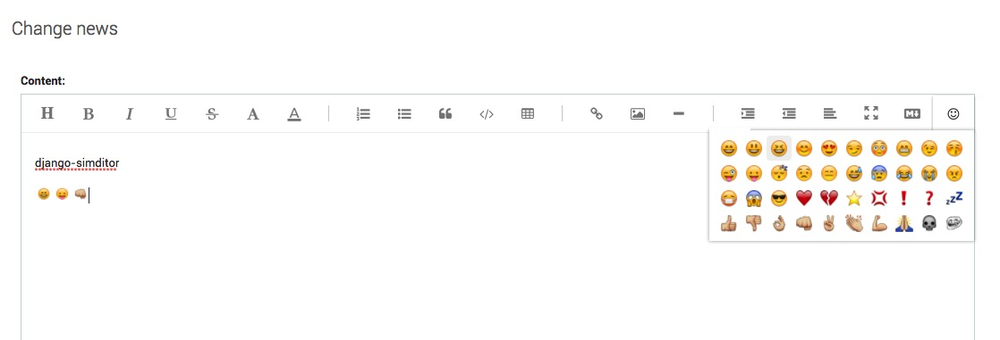
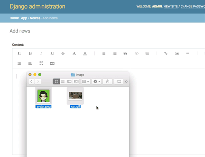

# django-simditor
django simditor

Installation
------------

```bash
pip install django-simditor
```

**Add `simditor` to your `INSTALLED_APPS` setting.**

```python
from django.db import models
from simditor.fields import RichTextField


class Post(models.Model):
    content = RichTextField()
```

**emoji**



**Markdown**


**Image upload config**

*drop image*



*clipboard image*


```bash
pip install pillow
```

`urls.py`


```python
urlpatterns = [
    url(r'^admin/', admin.site.urls),
    url(r'^simditor/', include('simditor.urls'))   # add this line
]
```

`settings.py`

```python
INSTALLED_APPS = [
    'django.contrib.admin',
    'django.contrib.auth',
    'django.contrib.contenttypes',
    'django.contrib.sessions',
    'django.contrib.messages',
    'django.contrib.staticfiles',

    'simditor'
]

SIMDITOR_UPLOAD_PATH = 'uploads/'
SIMDITOR_IMAGE_BACKEND = 'pillow'

SIMDITOR_TOOLBAR = [
    'title', 'bold', 'italic', 'underline', 'strikethrough', 'fontScale',
    'color', '|', 'ol', 'ul', 'blockquote', 'code', 'table', '|', 'link',
    'image', 'hr', '|', 'indent', 'outdent', 'alignment', 'fullscreen',
    'markdown', 'emoji'
]

SIMDITOR_CONFIGS = {
    'toolbar': SIMDITOR_TOOLBAR,
    'upload': {
        'url': '/simditor/upload/',
        'fileKey': 'upload'
    },
    'emoji': {
        'imagePath': '/static/simditor/images/emoji/'
    }
}
```
